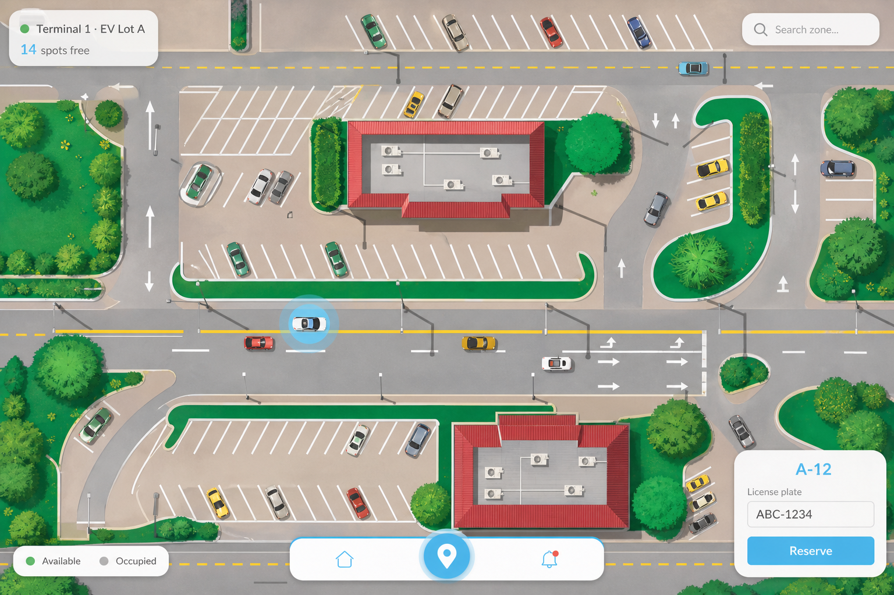

# SpotSync Web

Map-first Next.js frontend for [SpotSync](https://github.com/rayeemomayeer/SpotSync) — illustrated parking lot matching the locked desktop mockup, demo showcase layer, and spot-level reservations.



## Features

- Full-viewport illustrated parking map (SVG scene + d3-zoom pan/zoom)
- UI overlays match reference: zone pill, search, legend, reserve card, bottom dock
- Click-to-reserve with `spot_id` + demo auto-expiry (`X-Demo-Reservation`)
- One-click **Demo Driver** login (`alice@spotsync.com` / `DriverPass123!`)
- Client-only ghost traffic (GSAP drive-in paths, no API writes)
- Spot hover tooltip, last-spot stress highlight, admin spot toggle + paginated reservations
- Framer Motion for UI; GSAP for ghost paths only

## Setup

```bash
npm install
cp .env.example .env.local
npm run dev
```

Backend (migrations + seed):

```bash
cd ../SpotSync
make migrate-up
go run ./cmd/seed
make run
```

## Environment

| Variable | Description |
| --- | --- |
| `NEXT_PUBLIC_API_BASE_URL` | API base (default `http://localhost:8080/api/v1`) |
| `NEXT_PUBLIC_DEMO_MODE` | `true` — ghost traffic + demo booking headers |
| `NEXT_PUBLIC_DEMO_ADMIN_EMAIL` | Admin email for one-click demo |
| `NEXT_PUBLIC_DEMO_ADMIN_PASSWORD` | Admin password for demo login |

## Demo credentials

- **Driver:** `alice@spotsync.com` / `DriverPass123!`
- **Admin:** from backend `SEED_ADMIN_EMAIL` / `SEED_ADMIN_PASSWORD`

Demo reservations auto-expire after 10 minutes (backend lazy cleanup).

## Design reference

- `public/reference-desktop-map.png` — locked UI mockup
- `docs/design.md` — tokens, layout rules, animation catalog

## Scripts

| Command | Purpose |
| --- | --- |
| `npm run dev` | Local dev server |
| `npm run build` | Production build |
| `npm run lint` | ESLint |
| `npm run typecheck` | TypeScript check |
