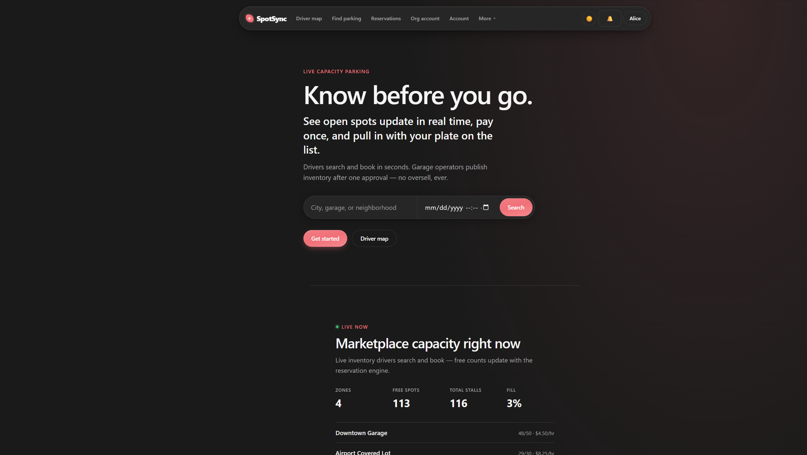
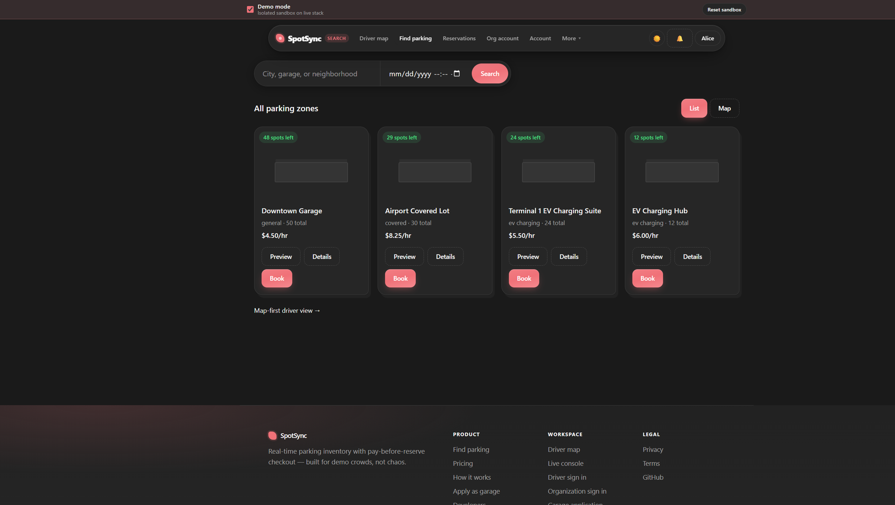
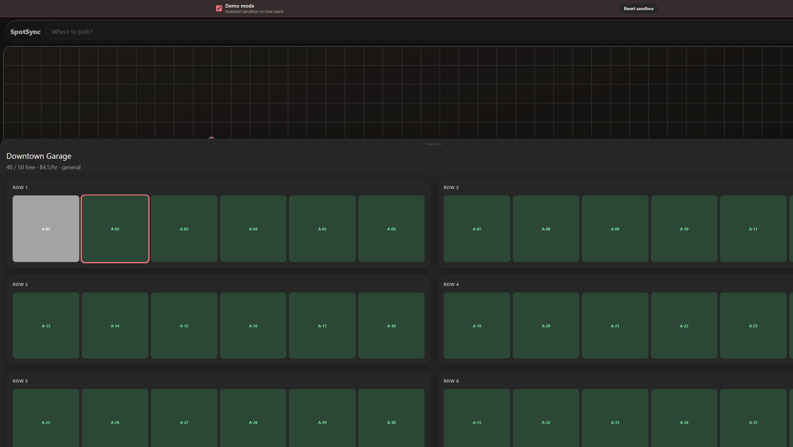
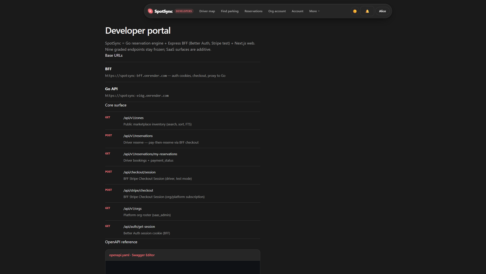

# SpotSync Web

> **Real-time parking marketplace** — drivers find and book a spot before they arrive, garage operators publish inventory that can never be oversold, and platform admins run the whole network from one console.

[](https://nextjs.org)
[](https://react.dev)
[](https://www.typescriptlang.org)
[](https://tailwindcss.com)
[](https://spotsync-nu.vercel.app)
[](#license)

**Live app → [spotsync-nu.vercel.app](https://spotsync-nu.vercel.app)**

This repository is the **Next.js frontend** of SpotSync. The reservation engine (Go), the auth/payments gateway (Express), and the email service live in sibling repos — see [The SpotSync stack](#the-spotsync-stack).



---

## Table of contents

- [What is SpotSync? (non-technical)](#what-is-spotsync-non-technical)
- [Try it in 60 seconds](#try-it-in-60-seconds)
- [Screenshots](#screenshots)
- [The SpotSync stack](#the-spotsync-stack)
- [Architecture](#architecture)
- [Product surfaces](#product-surfaces)
- [Tech stack](#tech-stack)
- [Engineering highlights](#engineering-highlights)
- [Getting started (local)](#getting-started-local)
- [Environment variables](#environment-variables)
- [Testing](#testing)
- [Deployment](#deployment)
- [License](#license)

---

## What is SpotSync? (non-technical)

Think of SpotSync as **"book a hotel room, but for a parking spot."**

- **Drivers** search a city, see how many spots are free *right now* (the numbers update live as other people book), pick an exact stall on a map, pay once, and arrive with their license plate already on the list.
- **Garage operators** apply to join the marketplace, get approved, subscribe to a plan, and publish their garages. The system guarantees they can never sell more spots than they physically have — even if hundreds of drivers hit "Book" at the same moment.
- **Platform admins** approve garages, watch network-wide KPIs, and monitor the health of every service from a built-in observability page.

The entire product runs live on free-tier cloud infrastructure as a portfolio demonstration. Payments use **Stripe test mode only** — no real money moves, and live payment keys are rejected at the server.

---

## Try it in 60 seconds

1. Open **[spotsync-nu.vercel.app](https://spotsync-nu.vercel.app)** (free-tier servers may take ~30 s to wake — the page shows a "waking stack" banner while they do).
2. Click **Get started** or use a one-click demo persona:

| Persona | What you can do | Email | Password |
| --- | --- | --- | --- |
| Driver | Browse the map, book a stall, cancel with refund | `alice@spotsync.com` | `DriverPass123!` |
| Org admin | Manage zones, spots, billing, members | `demo_admin@spotsync.com` | `DemoAdminPass123!` |
| Platform admin | Approve garages, KPIs, observability | `admin@spotsync.com` | `AdminPass123!` |

3. On the driver map, toggle **Demo mode** for an isolated sandbox on the real stack — demo bookings auto-release after 10 minutes, and you can reset the sandbox anytime.
4. To test checkout, pay with Stripe's test card `4242 4242 4242 4242` (any future expiry, any CVC) — or hit **Skip demo booking** to reserve without a card.

> These are seeded demo accounts on a sandboxed portfolio deployment — they are intentionally public.

---

## Screenshots

**Marketplace search** — live availability chips, list and map views:



**Driver map & spot grid** — pick the exact stall, see occupancy in real time:



**Live operations console** — zones, spot grid, and reserve panel synced over Server-Sent Events:


**Developer portal** — OpenAPI reference and endpoint map at [/developers](https://spotsync-nu.vercel.app/developers):



---

## The SpotSync stack

SpotSync is a four-service system. This repo is the web client; each service has its own repository and live deployment:

| Service | Role | Repository | Live URL |
| --- | --- | --- | --- |
| **Web** (this repo) | Next.js UI for drivers, orgs, platform admins | [spotsync-web](https://github.com/rayeemomayeer/spotsync-web) | [spotsync-nu.vercel.app](https://spotsync-nu.vercel.app) |
| **Go API** | High-concurrency reservation engine (never oversells) | [SpotSync](https://github.com/rayeemomayeer/SpotSync) | [spotsync-ei6g.onrender.com](https://spotsync-ei6g.onrender.com/healthz) |
| **BFF** | Express gateway — Better Auth sessions, Stripe checkout, API proxy | [spotsync-bff](https://github.com/rayeemomayeer/spotsync-bff) | [spotsync-bff.onrender.com](https://spotsync-bff.onrender.com/healthz) |
| **Notify** | Email receipts & auth mail via Resend | [spotsync-notify](https://github.com/rayeemomayeer/spotsync-notify) | internal (Render) |

Full multi-service local setup guide: **[docs/STACK.md](./docs/STACK.md)**.

---

## Architecture

```text
                     ┌──────────────────────────────┐
                     │   Browser — Next.js on Vercel │
                     └──────────────┬───────────────┘
                                    │ Better Auth cookies + JWT bridge
                                    ▼
                     ┌──────────────────────────────┐
                     │   BFF — Express on Render     │
                     │   /api/auth   (Better Auth)   │
                     │   /api/checkout, /api/stripe  │
                     │   /api/v1/*   (proxy to Go)   │
                     └───────┬───────────────┬──────┘
                             │               │
                             ▼               ▼
              ┌──────────────────────┐   ┌─────────────────┐
              │  Go reservation      │   │  Notify service  │
              │  engine (Render)     │   │  (Resend email)  │
              │  Postgres (Neon)     │   └─────────────────┘
              │  Redis (Upstash)     │
              └──────────────────────┘
                             +
                   Stripe Checkout (test mode)
```

Key decisions on the frontend side:

- **BFF pattern** — the browser talks to one origin for auth, payments, and API calls. Session cookies stay HTTP-only on the BFF; the Go API's JWT is bridged server-side, never exposed to `localStorage`.
- **Pay-then-reserve** — Stripe Checkout completes *before* the reservation is created, so capacity is never held by an unpaid cart.
- **Real-time by default** — zone availability streams over SSE; the map and console update without polling.
- **Free-tier resilience** — a "StackPulse" widget probes service health, a wake banner covers Render cold starts, and a GitHub Actions cron ([keep-warm.yml](./.github/workflows/keep-warm.yml)) pings `/healthz` to keep services warm.

---

## Product surfaces

| Route | Audience | Purpose |
| --- | --- | --- |
| [`/`](https://spotsync-nu.vercel.app/) | Everyone | Marketing landing with live marketplace stats |
| [`/search`](https://spotsync-nu.vercel.app/search) | Drivers | Browse zones — list/map, filters, live availability |
| [`/driver`](https://spotsync-nu.vercel.app/driver) | Drivers | Map-first booking with per-stall spot grid |
| `/book/[zoneId]` | Drivers | Quote hours → Stripe test checkout → confirmed booking |
| [`/reservations`](https://spotsync-nu.vercel.app/reservations) | Drivers | Booking history, cancel & refund |
| [`/account`](https://spotsync-nu.vercel.app/account) | Drivers | Profile & session |
| [`/login`](https://spotsync-nu.vercel.app/login) · [`/signup`](https://spotsync-nu.vercel.app/signup) | All | Better Auth — email/password + Google OAuth, driver/org tabs |
| [`/apply`](https://spotsync-nu.vercel.app/apply) | Operators | Garage self-application |
| `/org/*` | Org admins | Zones, spots, billing (Stripe subscription), members, observability |
| `/platform/*` | Platform admins | Org approvals, users, KPIs, network observability |
| [`/console`](https://spotsync-nu.vercel.app/console) | Demo / ops | Live three-column ops console over SSE |
| [`/developers`](https://spotsync-nu.vercel.app/developers) | Engineers | OpenAPI (ReDoc) + endpoint map |
| [`/pricing`](https://spotsync-nu.vercel.app/pricing) · [`/how-it-works`](https://spotsync-nu.vercel.app/how-it-works) | Everyone | Operator plans, product explainer |

Dark/light theme with system detection and a manual toggle across every surface.

---

## Tech stack

| Concern | Choice |
| --- | --- |
| Framework | [Next.js 16](https://nextjs.org) (App Router) + [React 19](https://react.dev) |
| Language | TypeScript 5 (strict) |
| Styling | [Tailwind CSS 4](https://tailwindcss.com), custom design system ([docs/design-system.md](./docs/design-system.md)) |
| Data fetching | [TanStack Query 5](https://tanstack.com/query) + SSE subscriptions |
| Auth | [Better Auth](https://better-auth.com) sessions (BFF) bridged to Go JWT |
| Payments | [Stripe](https://stripe.com) Checkout & subscriptions (test mode) |
| Animation | [Framer Motion](https://motion.dev) |
| Unit tests | [Vitest](https://vitest.dev) |
| E2E tests | [Playwright](https://playwright.dev) |
| Observability | Optional [Sentry](https://sentry.io) via `@sentry/nextjs` |
| Hosting | [Vercel](https://vercel.com) (security headers via `vercel.json`) |

---

## Engineering highlights

- **Role-aware routing** — driver, org admin, and platform admin each get their own guarded surface; access checks run before render, and unauthorized users are redirected with context.
- **Demo mode sandbox** — a first-class toggle that isolates showcase data on the production stack. Demo reservations carry a TTL and auto-release; a reset button clears the sandbox.
- **Live console** — a three-column operations view (zones → spot grid → reserve panel) driven by the Go engine's SSE stream; useful both as a product feature and as a visual proof of the no-oversell invariant.
- **Cold-start UX** — free-tier Render services sleep; the UI detects it, warms services before OAuth redirects, and shows honest progress instead of broken screens.
- **Typed API client** — one client (`src/lib/api/client.ts`) wraps the response envelope `{success, message, data}`, maps errors, and handles both BFF-proxied and direct Go API modes.

---

## Getting started (local)

Frontend only (pointing at the live backend):

```bash
git clone https://github.com/rayeemomayeer/spotsync-web.git
cd spotsync-web
npm install
cp .env.example .env.local   # defaults point to the live BFF
npm run dev                  # http://localhost:3000
```

Full four-service local stack (Go API + BFF + Notify + Web): follow **[docs/STACK.md](./docs/STACK.md)**.

---

## Environment variables

| Variable | Purpose |
| --- | --- |
| `NEXT_PUBLIC_API_BASE_URL` | API base — prefer the BFF proxy (`https://spotsync-bff.onrender.com/api/v1`) |
| `NEXT_PUBLIC_BFF_URL` | BFF origin for Better Auth + checkout |
| `NEXT_PUBLIC_FEATURE_FLAGS` | Comma list: `stripe_billing,driver_payments,demo_mode,google_oauth` |
| `NEXT_PUBLIC_DEMO_MODE` | Enables portfolio demo chrome (persona switcher, sandbox banner) |
| `NEXT_PUBLIC_SENTRY_DSN` | Optional — client-side error reporting |

See [.env.example](./.env.example) for the complete list with defaults.

---

## Testing

```bash
npm run lint         # ESLint
npm run typecheck    # tsc --noEmit
npm run test:unit    # Vitest unit tests
npm run build        # production build
npm run test:e2e     # Playwright end-to-end
npm run smoke:prod   # smoke checks against the live deployment
```

---

## Deployment

- **Vercel** — auto-deploys from `main`; `vercel.json` sets security headers (CSP, frame options, etc.).
- **Keep-warm** — [.github/workflows/keep-warm.yml](./.github/workflows/keep-warm.yml) pings the Render services' `/healthz` on a schedule so the free-tier backend stays responsive.
- Backend deployment (Render + Neon + Upstash) is documented in the [Go API repo](https://github.com/rayeemomayeer/SpotSync#deployment).

---

## License

MIT
