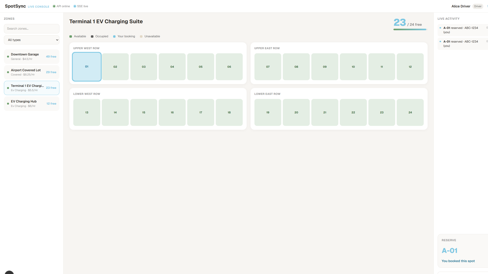

# SpotSync Web

Live Operations Console for [SpotSync](https://github.com/rayeemomayeer/SpotSync) — a real-time spot grid, SSE activity feed, and demo reservation flows consuming the frozen API.



## Features

- Three-column **Live Console**: zone rail, dynamic spot grid (4×6 showcase or chunked rows), activity feed + reserve panel
- Optimistic grid updates on reserve with rollback on 409
- Skeleton loading — no offline flash while spots sync
- **Your booking** highlight on owned spots; active-only bookings in the admin panel
- Debounced zone search, mobile tab layout, keyboard grid navigation
- Cancel toast + optimistic spot release; demo session badge; SSE reconnecting state
- Error boundary, dev API health banner, unit + Playwright smoke tests
- Real-time updates via SSE (`GET /zones/:id/events`)
- Zone browse with search, type filter, and availability sorting
- Click-to-reserve with `spot_id` + demo auto-expiry (`X-Demo-Reservation`)
- One-click **Demo Driver** / **Demo Admin** login
- Optional client-only ghost grid occupancy (`NEXT_PUBLIC_DEMO_GHOST_GRID`)
- Admin slide-over: my bookings, spot toggle, paginated all-reservations

## Setup

```bash
npm install
cp .env.example .env.local
npm run dev
```

Backend (migrations + seed):

```bash
cd ../SpotSync
make migrate-up
go run ./cmd/seed
make run
```

## Environment

| Variable | Description |
| --- | --- |
| `NEXT_PUBLIC_API_BASE_URL` | API base (default `http://localhost:8081/api/v1` if Apache uses 8080) |
| `NEXT_PUBLIC_DEMO_MODE` | `true` — demo booking headers + ghost grid eligibility |
| `NEXT_PUBLIC_DEMO_GHOST_GRID` | `true` — client-only simulated occupancy on random cells |
| `NEXT_PUBLIC_DEMO_ADMIN_EMAIL` | Admin email for one-click demo |
| `NEXT_PUBLIC_DEMO_ADMIN_PASSWORD` | Admin password for demo login |

## Demo credentials

- **Driver:** `alice@spotsync.com` / `DriverPass123!`
- **Demo admin:** `demo_admin@spotsync.com` / `DemoAdminPass123!`
- **Full admin:** from backend `SEED_ADMIN_EMAIL` / `SEED_ADMIN_PASSWORD`

Demo reservations auto-expire after 10 minutes (backend lazy cleanup).

## Design reference

- `docs/design.md` — Live Console spec, tokens, animation catalog

## Scripts

| Command | Purpose |
| --- | --- |
| `npm run dev` | Local dev server |
| `npm run build` | Production build |
| `npm run typecheck` | TypeScript check |
| `npm run test:unit` | Vitest unit tests |
| `npm run test:e2e` | Playwright smoke (set `SPOTSYNC_E2E_API=1` for full flow) |
